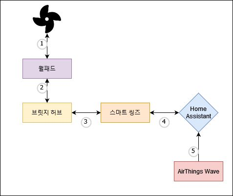

# radon_to_fan

라돈 수치 기반 아파트 환풍기 컨트롤 데몬

## 구성도




## Requirements 

- AppDaemon
  - https://appdaemon.readthedocs.io/en/latest/

## config

```yaml
radon_ctl:
  module: radonctl
  class: RemoveRadon
  radon_sensor: sensor.airthings_radon_1day_avg
  entity_to_control: fan.hwanpunggi
  min: 20
  max: 80
  on_speed: high
```

- `min` : 이 수치 미만일 경우 환풍기가 꺼짐 
- `max` : 이 수치 초과할 경우 환풍이 켜짐 
- `on_speed` : 환풍기 켜질때 속도 (low, medium, high) 
